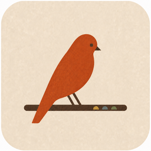
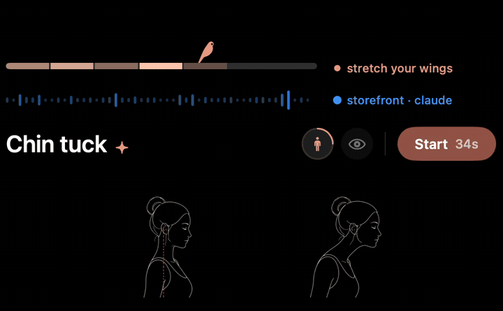
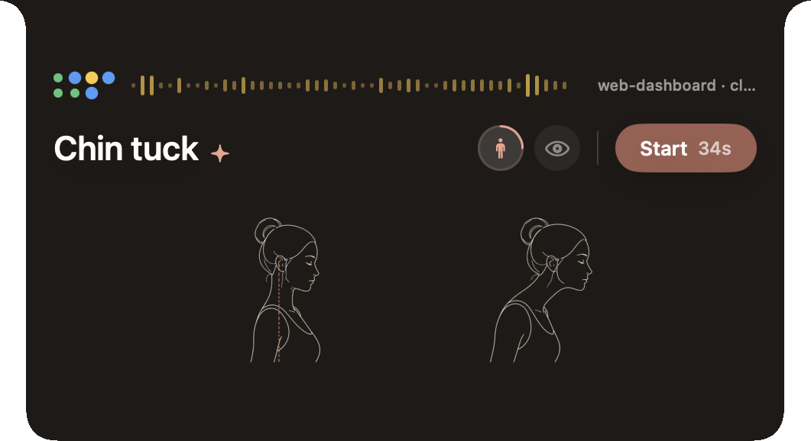
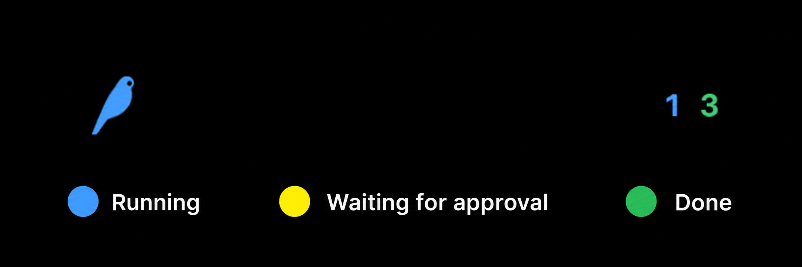
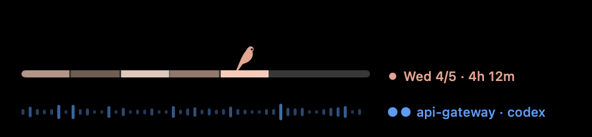
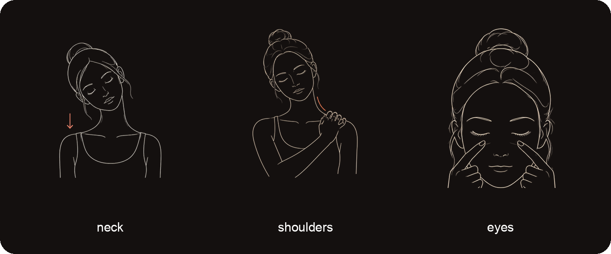

<div align="center">



# Perch

**Work with coding agents. Keep your focus, and take care of your body too.**

[](LICENSE)
[](https://github.com/mossfinch/perch/actions/workflows/test.yml)


**English** · [简体中文](README.zh-CN.md) · [日本語](README.ja.md)

[What changed in each version](CHANGELOG.md)



</div>

## Contents

- [Why Perch exists](#why-perch-exists)
- [Watching your agents for you](#watching-your-agents-for-you)
- [The week under the bird](#the-week-under-the-bird)
- [The 30-second moves](#the-30-second-moves)
- [Local data and privacy](#local-data-and-privacy)
- [Supported agents](#supported-agents)
- [Install](#install)
- [Uninstall and delete your data](#uninstall-and-delete-your-data)
- [If you change the App Group name](#if-you-change-the-app-group-name)
- [Development](#development)
- [Contributing](#contributing)
- [License](#license)

Perch is a little companion in your Mac's notch. It uses the rhythm of your work
with Claude Code and codex to keep track of focused time and remind you to move
after a long stretch of work.

The branch beneath the bird holds this week's focus record. The card has short
moves with illustrations and a beat to follow. While you wait for an agent,
give your body 30 seconds.



---

## Why Perch exists

Coding agents take a lot of the hands-on work off your plate, but they bring a
new rhythm of attention: hand off a task, wait, come back and check, approve,
start the next round. Each wait may be only a few tens of seconds or a few
minutes, but because you never know when the agent will come back, it is easy
to end up half-watching the terminal while your phone or another tab takes the
rest of you.

Perch is trying to protect two things: your focus and your health.

For focus, Perch looks at how fast you pick the agent's work back up and start
the next round, judges from that whether this stretch of collaboration is
still running continuously, and shows you the shape of your focus across the
day and the week.

For health, Perch turns a wait that was already happening into a short
recovery. The illustration means you don't have to work out how the move
goes, and the beat means you don't have to watch a separate timer. Follow it
through and you are back for the next round.

Perch gives no one a performance score. It shows two things you normally
can't see: the rhythm of your focus, and the chances to recover that are easy
to waste. You can see when the collaboration was running smoothly, when the
rhythm slackened, and whether those scattered waits were actually spent on
yourself.

---

## Watching your agents for you

Hooks in Claude Code and codex hand Perch the lifecycle states: running,
waiting for approval, and finished.

Collapsed, the bird on the left takes the colour of whatever needs your attention
most, and the counts for each state sit on the right. Hover the notch
and the card unfolds: one status dot per project, with the project names
cycling through one at a time. As long as one of those projects is waiting on
your approval, the name stops there until you deal with it.



---

## The week under the bird

The top row of the card is a branch running Monday to Sunday, with the bird
standing on today. Days that haven't happened yet stay grey. Days that are over
and the day under way are lit in a single coral colour at five levels of
brightness, showing the handoff rhythm Perch measured.

To the right of the branch, three things take their turn:

- **in flow 2h 37m**: the total time Perch judged your recent handoffs to be
  staying tight;
- **agents ran 5h 10m**: wall-clock time with at least one agent running.
  Several agents in parallel still count once;
- the name of the project that finished most recently.

The two durations are kept apart on purpose: an agent running is not the same
as you going quickly back and forth with it, and neither one is a total of
hours worked.

Hover a day on the branch and that area switches to showing that day's level,
its `in flow` duration and its `agents ran` duration.



### What Perch means by "in flow"

Perch uses "in flow" to estimate how long you stayed focused while working with
an agent. Recent handoff speed is its ruler: **after an agent finishes a round,
do you start the next one soon, and are those quick handoffs still going?**

Perch does not read screen contents, prompts, response text, or which app is in
front. It only sees agent lifecycle events, which keeps the reading local and
its boundary clear; the price is that reading, thinking and deciding produce no
handoffs, so they never get counted.

So it **infers** focus rather than reading attention directly. Reading,
thinking and deciding can be just as focused, and they get undercounted because
they leave no handoff behind, so the number can sometimes read lower than the
time you actually spent focused. This reading is good for watching how
continuous the collaboration was; it cannot judge the quality of the work, your
ability, or your output. When there is no `in flow` duration to show for a day,
the reading is `—`.

A day's level depends only on the `in flow` duration measured that day:

| Level | Measured that day |
| --- | --- |
| 1/5 | less than 1 hour |
| 2/5 | 1–2 hours |
| 3/5 | 2–4 hours |
| 4/5 | 4–6 hours |
| 5/5 | 6 hours or more |

The wave in the second row is the same verdict, live: brighter and quicker
while you are judged to be `in flow`. If the current verdict is wrong, press
the wave. If a day's level is wrong, press that day on the branch to step it
1 → 5 → 1. A correction only changes the verdict or level being displayed; it
never rewrites the raw events, and it never changes the durations already
measured.

---

## The 30-second moves

Work with a coding agent for hours and your attention keeps moving between
tasks while your body holds the same seated position throughout. Perch breaks
the neck, shoulder and eye care that is easiest to skip during a wait into
30-second moves: the illustration shows how to move, the beat tells you when to
switch, and you never have to leave what you are doing to go find a tutorial or
a timer.

When you are busy, a wait does not always feel like a rest. After an hour of
steady work with your agents, Perch picks a moment when you hand something off
and gently opens the card: *stretch your wings*. The little reminder stays under
the notch, and now and then it stretches too. Follow the illustration and the
beat for a moment; finish one move, and next time there is a different one.

When you finish one, Perch leaves a line in a local move log, so later you can
see what you actually did, not just that today you meant to get up and move
again.



Perch is not a medical device, and it offers no medical advice or health
promises. If a move causes pain, stop and talk to a professional.

---

## Local data and privacy

Perch needs no account and does not connect to the internet or upload usage data.
Agent states and move records stay on your Mac.

Perch does not store prompts or response text. It does store:

- agent running, waiting and finished events;
- the full path of every project you ran an agent in;
- a record of the moves you completed;
- any correction you made to the live verdict or to a day's level.

All of it stays on your machine. Full project paths are private information
too; if you would rather not keep them, see [Uninstall and delete your
data](#uninstall-and-delete-your-data) below.

The app is sandboxed. To connect your agents it may write to three folders and
no others: `~/.claude`, `~/.codex` and `~/.perch`, and it writes nothing there
until you press **Connect**.

<details>
<summary>Why the history rebuild exists, and what it reads</summary>

The app installer installs `~/.perch/bin/perch-reconcile`, which a LaunchAgent
runs at login and every 30 minutes. It reads lifecycle metadata out of Codex
rollouts and Claude transcripts to fill back in the start and end events the
hooks occasionally miss.

The working cache those scans produce lives in `~/.perch/reconciliation` and
can be deleted at any time. A plain LaunchAgent cannot write directly into a
Team-prefixed App Group, so the Perch app exchanges lifecycle rows and
validated derived results over the existing local socket, then writes them into
the container atomically. Neither direction carries prompt or response text,
and the sandboxed app never gains read access to your whole home directory.

</details>

---

## Supported agents

### Claude Code

The first time Perch opens, the card offers **Connect**; press it. Building
from source, `install-island-hooks.py` does the same.

### codex

Running, waiting for approval and finished all go through
`~/.codex/hooks.json`, which **Connect** (or `install-codex-island-hooks.py`)
fills in; a source install also rings the finished state through codex's notify
script. codex only runs hooks you have trusted in its `/hooks` panel. If the
bird never reacts to codex, or only the green count moves, that trust usually
hasn't been granted yet.

---

## Install

### Download

1. Download `Perch-<version>.zip` from the
   [latest release](https://github.com/mossfinch/perch/releases/latest) and
   unzip it. It runs on Apple silicon and Intel Macs with macOS 15 or newer.
2. Move **Perch** into **Applications**. It has to live there: the hooks find
   it at that path.
3. Open it. The first time, macOS asks you to allow it once:
   **System Settings → Privacy & Security → Open Anyway**.
4. The card opens by itself and offers **Connect**. Press it, and Perch wires up
   the agents it finds on this Mac. For codex, trust the new hooks once in its
   `/hooks` panel.

The download leaves out the history rebuild described above; to get it, build
from source.

### Build from source

You need:

- **macOS 15 or newer**;
- **Xcode** with a Swift 6 toolchain; no Apple developer account is needed, the
  app is ad-hoc signed on your own machine;
- **python3**; `/usr/bin/python3` is available once Xcode is installed;
- an admin account that can write to `/Applications`; `sudo` is never used;
- **Node 22**, only if you want to run the tests.

```bash
python3 install-island-app.py          # build → /Applications/Perch.app → launch at login
python3 install-island-hooks.py        # wire up Claude Code
python3 install-codex-island-hooks.py  # wire up codex; grant hook trust once when prompted
```

On first launch, macOS asks you to allow the app once:
**System Settings → Privacy & Security → Open Anyway**.

The app installer will not overwrite some other app sitting at
`/Applications/Perch.app`; when it finds an older Perch, it moves the old
version aside rather than deleting it. When it is done, it connects to Perch's
socket for real, confirming that the app is not just running as a process but
is actually able to receive events.

<details>
<summary>What connecting changes</summary>

**Connect** and the hook installers follow the same rules and write the same
bytes. They first leave a timestamped `.perch-backup-*` copy beside
your existing config, then append only the entries that belong to Perch. They
never reorder, remove or rewrite anyone else's hooks, including hooks that
happen to sit in the same group as Perch's.

Before writing, they check that every foreign entry is still byte-for-byte what
it was when read and still in the same position; if something else changed the
config in the meantime, they abort and leave the file untouched. The final
replacement is an atomic rename, so no half-written config can be left behind.

</details>

---

## Uninstall and delete your data

Remove the app, its launch-at-login entry, and the history rebuild tool:

```bash
launchctl bootout gui/$UID/io.github.mossfinch.perch
rm ~/Library/LaunchAgents/io.github.mossfinch.perch.plist
launchctl bootout gui/$UID/io.github.mossfinch.perch.reconcile
rm ~/Library/LaunchAgents/io.github.mossfinch.perch.reconcile.plist
rm ~/.perch/bin/perch-reconcile
rm -f ~/.perch/bin/perch-hook
rm -rf ~/.perch/reconciliation
rm -rf /Applications/Perch.app
```

If you installed the hooks, you also need to remove Perch's entries from:

- `~/.claude/settings.json` and `~/.codex/hooks.json`: delete the Perch entries
  whose command mentions `.perch/bin/perch-hook` (older versions wrote
  `bridge.sock`), or restore the `.perch-backup-*` copy
  sitting beside each file;
- `~/.codex/hooks/codex-notify-sound.sh`: delete the completion-sound block
  headed `# --- Perch`. This file gets a `.perch-backup-*` copy of its own, so
  restoring it is an option here too.

Delete every piece of local data Perch stored:

```bash
rm -rf ~/Library/Group\ Containers/group.io.github.mossfinch.perch
```

That folder holds the move log `care-ledger.json`, the raw agent events
`agent-events/*.jsonl`, and the rebuildable derived history and health state
under `reconciliation/`. The raw history Codex and Claude keep for themselves
stays in their own directories and is not deleted by this command.

---

## If you change the App Group name

The container path follows the App Group name, so your old move log will not
show up in the new container by itself. Migrate it explicitly:

```bash
python3 install-island-app.py --migrate-from <old-app-group-id>
```

The installer only copies, never deletes; it refuses to overwrite an existing
log, refuses symlinks and unreadable ledgers, and writes into the new container
atomically.

---

## Development

```bash
xcodebuild -project Perch.xcodeproj -scheme Perch build   # or open in Xcode
node --test tests/island-*.test.js                        # run the tests
```

`perch-package.json` is the single manifest of the public package's file
boundary. A privacy guard in the test suite scans every file the manifest
covers.

To record the island without showing your own projects or week, stop the
running Perch and start it with `--demo`. It shows made-up projects and a
made-up week from a scratch folder and leaves your own data alone. Quit it with
Ctrl-C, and the last line brings your Perch back.

```bash
launchctl bootout gui/$UID/io.github.mossfinch.perch
/Applications/Perch.app/Contents/MacOS/Perch --demo
launchctl bootstrap gui/$UID ~/Library/LaunchAgents/io.github.mossfinch.perch.plist
```

---

## Contributing

Use issues to ask questions, report problems, or suggest improvements. Pull requests
are welcome too; see [CONTRIBUTING.md](CONTRIBUTING.md) to get started.
If you find a security vulnerability or your report contains personal information,
use a [private advisory](https://github.com/mossfinch/perch/security/advisories/new).
See [SECURITY.md](SECURITY.md) for details.

## License

MIT — see [LICENSE](LICENSE).
