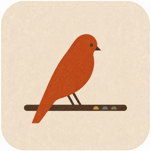
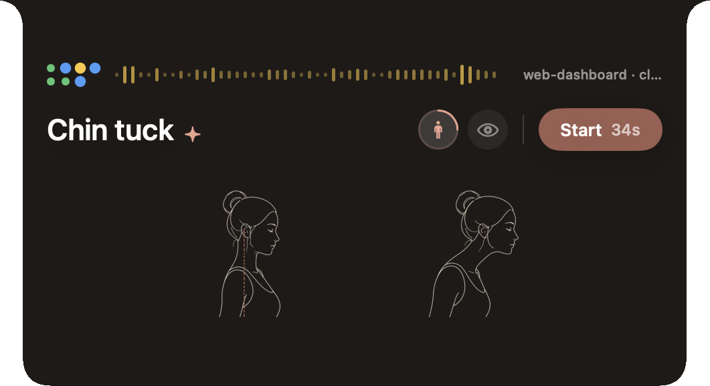
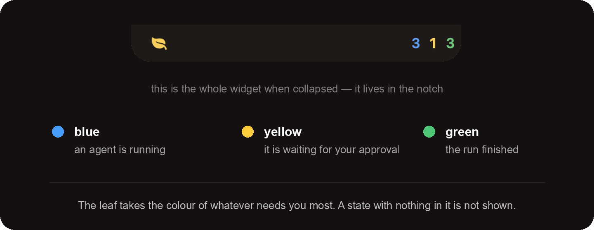
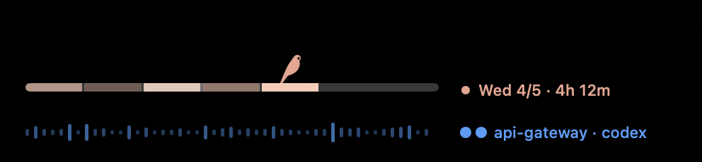
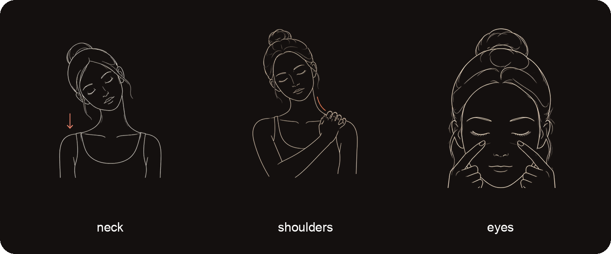

<div align="center">



# Perch

**住在 Mac 刘海里的搭档：替你盯着 coding agent，
记下你和它们一起度过的这一周，把等待变成 30 秒的小恢复。**

[](LICENSE)


[English](README.md) · **简体中文** · [日本語](README.ja.md)

</div>

你把任务交给 Claude Code 或 codex。Perch 替你看着：蓝色表示 agent 正在运行，
黄色表示它需要你，绿色表示已经完成。你可以把视线移开，不必为了错过一次批准而一直盯着终端。

展开卡片后，Perch 还会：

- 按项目显示 agent 当前处于运行、等待还是完成；
- 用这一周的交接节奏，帮助你看见自己的专注状态；
- 在等待时给你一个有图解和节拍的 30 秒动作，做完后留下一条本地记录。

等待本来就已经发生了。Perch 只是让它不必继续变成盯屏时间。



---

## 为什么做 Perch

Coding agent 减少了亲手执行的时间，却带来一种新的注意力节奏：下任务、等待、回来检查、
批准，再启动下一轮。每次等待可能只有几十秒或几分钟，但因为不知道 agent 什么时候回来，
人很容易一边盯着终端，一边被手机或别的页面带走。

Perch 想保护两件事：

- **专注**：根据你接回 agent 结果、启动下一轮的速度，判断这段人机协作是否保持连续，
  再把一天和一周的专注节奏显示出来；
- **健康**：把本来就存在的等待变成一次短恢复。图解让你不用先研究动作怎么做，
  节拍让你不用另看计时器，照着完成就可以回到下一轮工作。

它不是为了给人打绩效分，而是让原本看不见的专注节奏和容易被浪费的恢复机会变得可见：
什么时候协作很连贯，什么时候专注节奏松开了，以及那些零碎等待有没有真的拿来恢复自己。

---

## 替你看着 agent

Claude Code 和 codex 的 hook 会把运行、等待批准和完成这些生命周期状态交给 Perch。

收起时，刘海两侧显示各状态的数量，叶子采用当前最需要你注意的状态颜色。
悬停刘海后卡片展开：每个项目有一个状态圆点，项目名依次轮播；只要其中一个项目在等你批准，
名字就停在它上面，直到你处理。



---

## 小鸟脚下的一周

卡片第一行是一根从周一到周日的横木，小鸟站在今天。还没发生的日子保持灰色；
已经过完和正在进行的日子，用同一种珊瑚色的五档明暗显示 Perch 测得的交接节奏。

横木右边会依次显示三类内容：

- **in flow 2h 37m**：Perch 判定近期交接保持紧密的累计时间；
- **agents ran 5h 10m**：至少有一个 agent 正在运行的墙上时钟时间。多个 agent 并行仍只算一次；
- 最近完成的项目名。

这两个时长刻意分开：agent 在运行，不等于你正在和它快速来回；它们也都不是工时总和。

把鼠标移到横木的某一天，右侧就改为显示那一天的等级、`in flow` 时长和
`agents ran` 时长。



### Perch 所说的 “in flow”

Perch 用 “in flow” 估算你在 agent 协作中保持专注的时长。它拿最近的交接速度当尺子：
**agent 完成一轮后，你是否很快启动下一轮，而且这种快速交接最近仍在继续。**

Perch 不读取屏幕内容、提示词、回复正文或前台 app。它只看 agent 生命周期事件，
所以这个读数保持本地而且边界明确；代价是阅读、思考和做决定不会产生交接，
也就不会被算进来。

所以它是在**推断专注状态**，不是直接读取注意力。阅读、思考和做决定可能同样专注，
却因为没有产生交接而被少算，读数有时候可能低于你的实际专注时间。这个读数适合用来观察
人机协作的连续程度，不能用来评价工作质量、能力或产出。当天没有可显示的 `in flow` 时长时，
读数显示 `—`。

每天的等级只取决于当天测得的 `in flow` 时长：

| 等级 | 当天测得的时长 |
| --- | --- |
| 1/5 | 少于 1 小时 |
| 2/5 | 1–2 小时 |
| 3/5 | 2–4 小时 |
| 4/5 | 4–6 小时 |
| 5/5 | 6 小时及以上 |

第二行的波形是同一个判断的实时版本：判定为 `in flow` 时更亮、更快。
如果当前判定不对，可以按一下波形；如果某一天的等级不对，可以按横木上的那一天，
让等级在 1 → 5 → 1 之间前进。纠正只改变显示出来的判定或等级，
不会重写原始事件，也不会改掉已经测得的时长。

---

## 30 秒动作

长时间与 coding agent 协作，注意力在任务之间来回，身体却往往一直保持同一个坐姿。
Perch 把等待时最容易忽略的脖子、肩膀和眼睛照顾拆成 30 秒动作：图解说明怎么动，
节拍告诉你什么时候换动作，不需要离开当前工作环境重新找教程或计时器。

完成后，Perch 会在本地动作记录中留下一笔，方便以后看到自己实际做过什么，
而不只是今天又打算起来活动一下。



Perch 不是医疗设备，也不提供医疗建议或健康承诺。如果动作引起疼痛，请停止并咨询专业人士。

---

## 本地数据与隐私

Perch 不需要账号，也没有遥测。**这个包里任何地方都没有联网代码**：agent 与 app 之间
通过 App Group 容器里的 Unix domain socket 通信，而 `AF_UNIX` 这种 socket 根本连不上网络
——**这是操作系统强制的，不是靠代码自觉**。

Perch 不保存提示词或回复正文。它会保存：

- agent 的运行、等待和完成事件；
- 你运行 agent 的项目完整路径；
- 动作完成记录；
- 你对实时判定或每日等级做过的纠正。

这些数据都留在本机。项目完整路径也属于隐私信息；如果不想保留，见下面的“卸载与删除数据”。

<details>
<summary>历史重建为什么存在，以及它读取什么</summary>

app 安装脚本会安装 `~/.perch/bin/perch-reconcile`，由 LaunchAgent 在登录时和每 30 分钟运行一次。
它读取 Codex rollout 和 Claude 会话记录中的生命周期元数据，用来补回 hook 偶尔漏掉的开始与结束事件。

扫描得到的工作缓存位于 `~/.perch/reconciliation`，可以随时删除。普通 LaunchAgent 不能直接写入
带 Team 的 App Group，所以 Perch app 通过现有的本地 socket 交换生命周期行和经过校验的派生结果，
再原子写入容器。两个方向都不携带提示词或回复正文，沙箱内的 app 也不会获得整个家目录的读取权限。

</details>

---

## 支持的 agent

### Claude Code

运行 `install-island-hooks.py` 后即可接入。

### codex

完成状态通过 codex 的 notify 脚本接入；运行中和等待批准状态通过 `~/.codex/hooks.json` 接入。
codex 只会执行你在 `/hooks` 面板中信任过的 hook。如果绿色数量会变化，但蓝色和黄色始终不动，
通常是那次信任还没授权。

---

## 安装

你需要：

- **macOS 15 或更新版本**；
- 带 Swift 6 工具链的 **Xcode**；不需要 Apple 开发者账号，app 使用本机 ad-hoc 签名；
- **python3**；安装 Xcode 后可使用 `/usr/bin/python3`；
- 能写入 `/Applications` 的管理员账号，全程不使用 `sudo`；
- **Node 22**，仅在你想运行测试时需要。

```bash
python3 install-island-app.py          # 构建 → /Applications/Perch.app → 登录时启动
python3 install-island-hooks.py        # 接入 Claude Code
python3 install-codex-island-hooks.py  # 接入 codex；按提示授权一次 hook 信任
```

首次启动时，macOS 会要求放行一次：
**系统设置 → 隐私与安全性 → 仍要打开**。

app 安装脚本不会覆盖 `/Applications/Perch.app` 位置上的其他 app；发现旧 Perch 时，
它会先把旧版本移开而不是删除。安装结束后，它还会真正连接一次 Perch 的 socket，
确认 app 不只是进程存在，而是已经能够接收事件。

<details>
<summary>hook 安装脚本会改什么</summary>

hook 安装脚本会先在原配置旁留下带时间戳的 `.perch-backup-*` 备份，然后只追加属于 Perch 的条目。
它不会重排、删除或改写其他 hook，即使别人的 hook 和 Perch 位于同一个分组里也一样。

写入前，脚本会确认所有外部条目仍与读取时逐字节相同、位置也没有变化；
如果配置在中途被别人改过，它会中止并保持原文件不变。最终替换采用原子改名，
不会留下只写了一半的配置文件。

</details>

---

## 卸载与删除数据

卸载 app、登录启动项和历史重建工具：

```bash
launchctl bootout gui/$UID/io.github.mossfinch.perch
rm ~/Library/LaunchAgents/io.github.mossfinch.perch.plist
launchctl bootout gui/$UID/io.github.mossfinch.perch.reconcile
rm ~/Library/LaunchAgents/io.github.mossfinch.perch.reconcile.plist
rm ~/.perch/bin/perch-reconcile
rm -rf ~/.perch/reconciliation
rm -rf /Applications/Perch.app
```

如果安装过 hook，还需要从下面的位置移除 Perch 条目：

- `~/.claude/settings.json` 和 `~/.codex/hooks.json`：删除命令中包含 `bridge.sock` 的 Perch 条目，
  或恢复旁边的 `.perch-backup-*` 备份；
- `~/.codex/hooks/codex-notify-sound.sh`：删除以 `# --- Perch` 开头的完成提示音区块。
  这个文件也有自己的 `.perch-backup-*` 备份，所以这里同样可以直接恢复。

删除 Perch 保存的全部本地数据：

```bash
rm -rf ~/Library/Group\ Containers/group.io.github.mossfinch.perch
```

这个目录包括动作记录 `care-ledger.json`、原始 agent 事件 `agent-events/*.jsonl`，
以及 `reconciliation/` 下可以重建的派生历史和健康状态。Codex 和 Claude 自己保存的原始历史
仍然留在各自的目录中，不会被这条命令删除。

---

## 如果修改 App Group 名称

容器路径跟随 App Group 名称变化，旧动作记录不会自动出现在新容器中。请显式迁移：

```bash
python3 install-island-app.py --migrate-from <旧的-app-group-id>
```

安装脚本只复制、不删除；它拒绝覆盖已经存在的记录，也拒绝软链接和无法读取的账本，
并以原子方式写入新容器。

---

## 开发

```bash
xcodebuild -project Perch.xcodeproj -scheme Perch build   # 或使用 Xcode 打开
node --test tests/island.test.js                          # 运行测试
```

`perch-package.json` 是公开包文件边界的唯一清单。测试中的隐私守卫会扫描清单覆盖的全部文件。

---

## 许可证

MIT —— 见 [LICENSE](LICENSE)。
